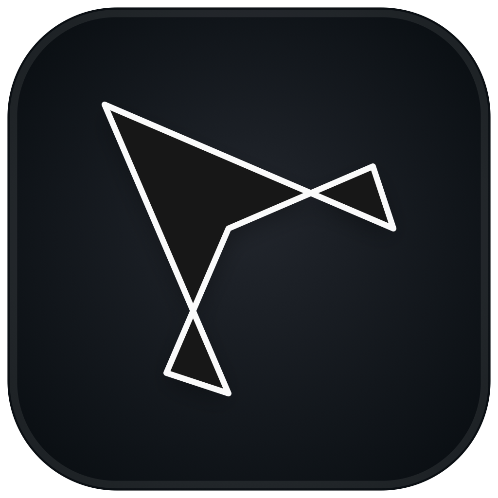
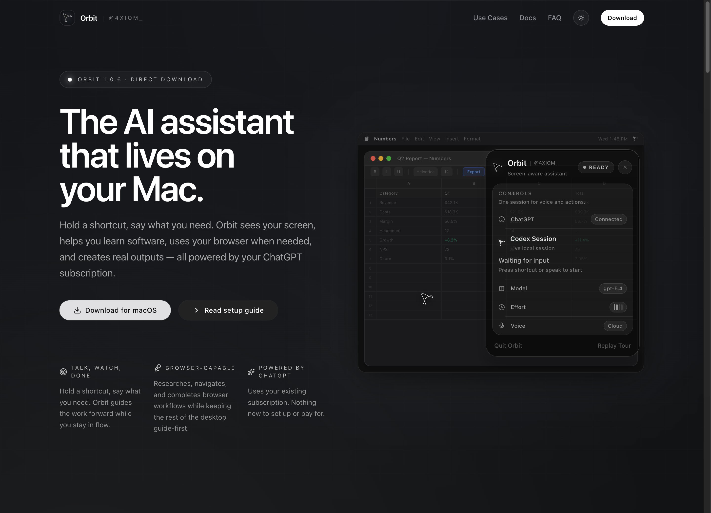

# Orbit

<p align="center">
  
</p>

<p align="center">
  <strong>Screen-aware AI assistant for macOS, built on Codex by OpenAI.</strong>
</p>

<p align="center">
  Orbit lives in your menu bar, sees your current screen, listens for push-to-talk requests,
  and helps you learn software, complete browser tasks, and get guided help directly on your Mac.
</p>

<p align="center">
  <a href="https://orbitcodex.org">Website</a> ·
  <a href="https://orbitcodex.org/download">Download</a> ·
  <a href="https://github.com/sponsors/4xiomdev">Sponsor</a> ·
  <a href="https://x.com/4xiom_">X / @4xiom_</a>
</p>

<p align="center">
  <a href="https://orbitcodex.org"></a>
  <a href="https://orbitcodex.org/download"></a>
  <a href="LICENSE"></a>
  
</p>

<p align="center">
  
</p>

## What Orbit is

Orbit is a direct-download macOS assistant that brings a live Codex session onto your desktop in a way that feels native, visual, and immediate.

Instead of opening a separate coding tool or chat tab, you talk to Orbit from anywhere on your Mac. It can capture your current screen, narrate what it is doing, move its cursor overlay to the right place, and help you learn or complete tasks in context.

Orbit is an independent open-source project. It is built on Codex by OpenAI, but it is not an official OpenAI product.

## Why people use it

- Learn unfamiliar software with a guide that can see the same screen you do.
- Get browser help and step-by-step actions without leaving your current workflow.
- Ask for explanations while working in design, creative, research, and productivity tools.
- Keep a lightweight desktop assistant available without managing a terminal-first Codex setup.

## Quick install

1. Open the [download page](https://orbitcodex.org/download).
2. Download the latest PKG installer.
3. Run the installer, then open Orbit from `Applications`.
4. Look for the Orbit icon in your menu bar.

Installers are published through [`4xiomdev/orbit-downloads`](https://github.com/4xiomdev/orbit-downloads/releases/latest). The PKG is the primary install path, with a DMG attached as a quiet fallback.

## Quick start

1. Grant the requested desktop permissions.
2. Orbit checks whether its Codex runtime is already authenticated.
3. If authentication is required, Orbit opens the managed ChatGPT browser flow for you.
4. Choose `Local` or `Cloud` voice.
5. If you choose `Cloud`, add your OpenAI API key once. Orbit validates it and stores it in your macOS Keychain.
6. Hold the Orbit push-to-talk shortcut and ask for help from any screen.

## How Orbit works

- Orbit runs as a menu bar app with a compact panel and overlay HUD.
- Each app run keeps one live Codex app-server session active in the background.
- Orbit can attach your current screen to requests so Codex has visual context.
- Final responses can include pointing tags, which Orbit turns into cursor guidance on screen.
- Voice, auth, and action settings stay lightweight and local to the machine.

## Voice modes

### Local

- Apple Speech transcription
- Apple system speech
- no extra API key required

### Cloud

- OpenAI `gpt-4o-mini-transcribe`
- OpenAI `gpt-4o-mini-tts`
- your API key is stored in the macOS Keychain, not in the repo or app bundle

## Privacy and security

- Orbit ships with **no bundled third-party telemetry** in the open-source build.
- Orbit has **no hosted backend** of its own.
- Cloud voice uses the user-supplied OpenAI API key stored in Keychain.
- Orbit keeps its Codex runtime state in `~/Library/Application Support/Orbit/CodexHome`.
- Orbit is a direct-download macOS utility and requires full desktop permissions to work as designed.

Read [SECURITY.md](SECURITY.md) before reporting vulnerabilities.

## Development

Requirements:

- macOS 14.2 or later
- Xcode
- a local or bundled Codex runtime

Build locally:

```bash
xcodebuild -project Orbit.xcodeproj -scheme Orbit -destination 'platform=macOS' build CODE_SIGNING_ALLOWED=NO
```

Run unit tests:

```bash
xcodebuild -project Orbit.xcodeproj -scheme Orbit -destination 'platform=macOS' -only-testing:OrbitTests test CODE_SIGNING_ALLOWED=NO
```

For a local app run with full signing, open [Orbit.xcodeproj](Orbit.xcodeproj/project.pbxproj) in Xcode, choose your signing team, and run the `Orbit` scheme.

## Releases

Orbit is distributed as a signed direct download. The release pipeline:

- archives the macOS app
- bundles a Codex runtime into the final app
- exports a signed Developer ID build
- creates a PKG installer and DMG fallback
- notarizes and staples the public artifacts when credentials are configured

Release automation lives in [scripts/release.sh](scripts/release.sh). More notes are in [scripts/README.md](scripts/README.md).

## Repo guide

- [CONTRIBUTING.md](CONTRIBUTING.md) for local setup and contribution flow
- [SUPPORT.md](SUPPORT.md) for user support and feature routing
- [SECURITY.md](SECURITY.md) for vulnerability reporting
- [CODE_OF_CONDUCT.md](CODE_OF_CONDUCT.md) for community expectations

## Support the project

- Sponsor Orbit: [GitHub Sponsors](https://github.com/sponsors/4xiomdev)
- Follow updates: [x.com/4xiom_](https://x.com/4xiom_)
- Launch site: [orbitcodex.org](https://orbitcodex.org)

## Acknowledgements

Orbit’s codebase is original, but the project was meaningfully inspired by the interface ideas explored in Clicky. Thanks to that project for helping make desktop-native AI interaction feel possible.
